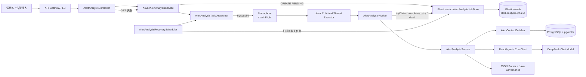
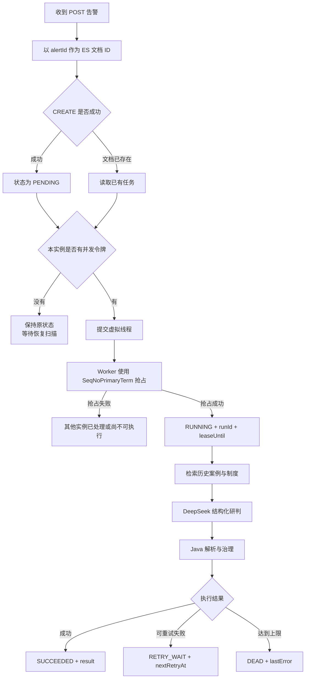
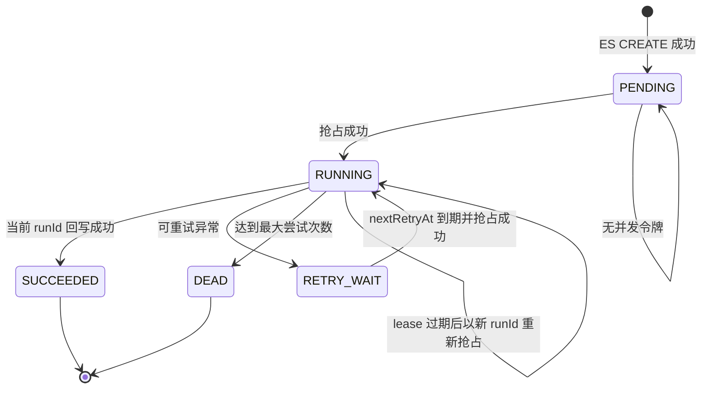
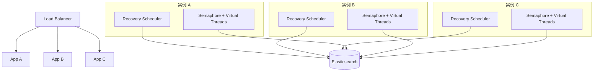
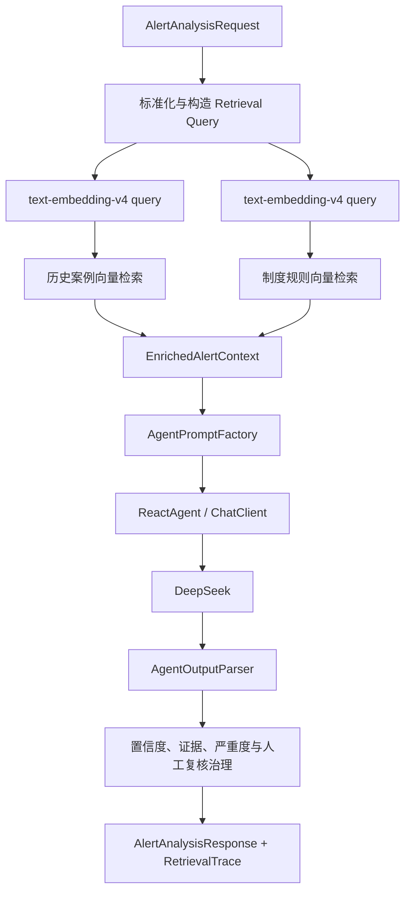
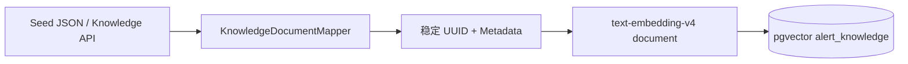
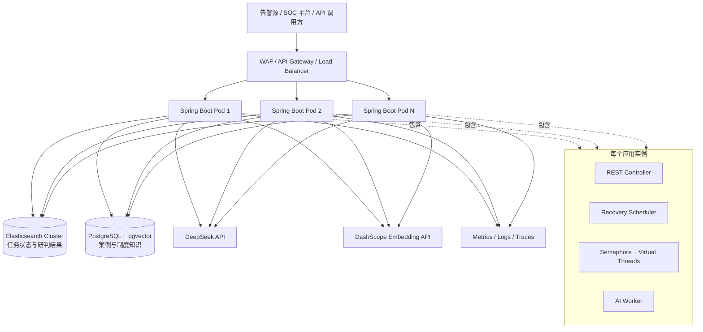

# V0.3 架构设计：Elasticsearch 持久化任务与 Java 虚拟线程

> 适用代码：`main` 分支 V0.3。本文描述当前已经实现的异步告警研判链路，并明确生产部署时需要遵守的边界。

## 1. 目标与边界

V0.3 解决的是“告警先写入 Elasticsearch，再异步执行 AI 研判”的可靠性问题：

- API 不等待 RAG 与大模型调用，提交后立即返回 `202 Accepted`；
- 告警任务先持久化为 `PENDING`，再创建虚拟线程，避免进程在两步之间宕机后任务永久丢失；
- 多实例通过 Elasticsearch 乐观锁竞争任务，允许重复扫描，但只允许一个 Worker 有效持有任务；
- 通过 `runId + leaseUntil` 处理 Worker 宕机、超时重跑和旧结果迟到；
- 通过 `Semaphore` 限制真实 AI 在途并发，不把“虚拟线程轻量”误解为“下游容量无限”；
- 研判失败可进入退避重试，达到上限后进入 `DEAD`，保留人工处理入口。

当前边界：

- Elasticsearch 是**任务状态和研判结果的事实来源**；
- PostgreSQL + pgvector 是**知识检索存储**，不参与任务状态事务；
- DeepSeek 负责生成结构化研判，Java 负责结果解析和治理约束；
- 系统只输出研判结果与处置建议，不自动执行封禁、隔离、删除等高风险动作；
- 当前语义是“任务至少执行一次、结果单写生效”，不是跨 Elasticsearch、pgvector、模型服务的分布式事务。

## 2. 总体架构图



这张图中有两条不同的数据链路：

1. **任务控制链路**：Controller → Async Service → Elasticsearch → Dispatcher → Worker → Elasticsearch；
2. **AI 研判链路**：Worker → RAG → DeepSeek → Java Governance → Elasticsearch。

控制链路必须先完成持久化，AI 链路才允许开始。

## 3. 组件职责

| 组件 | 主要职责 | 不负责的事情 |
|---|---|---|
| `AlertAnalysisController` | 接收异步提交、状态查询；保留同步兼容接口 | 不直接创建线程，不直接修改 ES 状态 |
| `AsyncAlertAnalysisService` | 先创建 `PENDING` 文档，再尝试调度 | 不执行 RAG 或模型调用 |
| `AlertAnalysisTaskDispatcher` | 获取本实例并发令牌，提交虚拟线程，任务结束后释放令牌 | 不判断任务是否归当前实例所有 |
| `AlertAnalysisWorker` | 生成 `runId`、抢占任务、执行 AI、回写成功或失败状态 | 不把异常吞掉后伪装为成功 |
| `ElasticsearchAlertAnalysisJobStore` | 固定 ID 创建、状态读取、乐观锁迁移、恢复任务查询 | 不执行模型推理 |
| `AlertAnalysisRecoveryScheduler` | 周期扫描 `PENDING`、到期重试和租约过期任务 | 不绕过 Dispatcher 的并发限制 |
| `AlertAnalysisService` | 原有同步研判核心：RAG、Prompt、模型、解析与治理 | 不管理异步任务生命周期 |
| Elasticsearch | 保存任务请求、状态、租约、重试信息和最终结果 | 不承担跨系统事务 |
| PostgreSQL + pgvector | 保存案例与制度知识，完成向量检索 | 不保存异步任务状态 |

## 4. 正常数据流



API 返回 `202` 只表示任务已经持久化并接受处理，不表示 AI 已完成。

## 5. 任务状态机



状态迁移必须满足以下约束：

- `PENDING`、到期的 `RETRY_WAIT`、租约过期的 `RUNNING` 才可被抢占；
- `complete`、`markRetry`、`markDead` 只接受当前 `RUNNING` 文档上的同一个 `runId`；
- `SUCCEEDED` 和 `DEAD` 是当前实现的终态；
- 同一个 `alertId` 表示同一个不可变任务。需要重新研判时，应生成新的任务 ID，或后续增加显式 re-run API，不能用重复 POST 静默覆盖原任务。

## 6. 一致性模型与核心不变量

### 6.1 先持久化，再调度

```text
Elasticsearch CREATE(PENDING) 成功
                ↓
        Dispatcher.dispatch(alertId)
```

因此进程即使在两步之间宕机，恢复扫描仍能找到 `PENDING`。

### 6.2 固定业务 ID 保证提交幂等

```text
ES _id = alertId
op_type = create
```

相同 `alertId` 的重复提交不会创建第二份文档，也不会覆盖已经运行或完成的任务。

### 6.3 乐观锁保证单次状态迁移

`AlertAnalysisJobDocument` 携带 Elasticsearch 返回的 `SeqNoPrimaryTerm`。保存时使用该并发版本；如果其他实例已先修改文档，当前保存会冲突，代码重新读取最新状态再判断。

### 6.4 runId 保证只有当前执行者能提交结果

租约过期后，新 Worker 会生成新的 `runId`。旧 Worker 即使稍后返回，也因 `runId` 不匹配而无法写入结果。

### 6.5 业务语义

```text
至少一次调度 / 执行
+
单文档乐观锁状态迁移
+
runId 所有权校验
=
允许重复尝试，但只允许当前任务结果生效
```

AI 研判、RAG 查询必须保持无副作用。若未来在 Worker 中加入封禁、隔离、建单或通知，需要为每个外部动作增加独立幂等键和审计记录。

## 7. 多实例协调模型



每个实例都可以扫描到同一个任务，这不是错误。真正的全局互斥由 Elasticsearch 乐观锁完成。

需要特别注意：`maxInFlight` 是**单实例**限制，集群理论最大在途量约为：

```text
clusterMaxInFlight = applicationReplicaCount × maxInFlightPerInstance
```

如果模型服务只允许 100 个并发，部署 4 个实例时，不能每个实例都配置 100。应预留故障和重试余量后再分配到各实例。

## 8. AI 研判内部架构



案例和制度当前共用 pgvector 表，通过 Metadata Filter 隔离：

```text
knowledgeType == HISTORICAL_CASE && active == true
knowledgeType == POLICY_RULE && active == true
```

Query 使用 `text_type=query`，知识入库使用 `text_type=document`，避免查询和文档采用错误的 Embedding 任务类型。

## 9. 知识入库链路



知识 ID 由 `knowledgeType + sourceId + version` 稳定生成，重复导入执行幂等 Upsert。

## 10. 生产部署拓扑



生产环境建议：

- Elasticsearch 至少配置副本，并对任务索引建立显式模板、容量告警和快照策略；
- pgvector 使用独立连接池，不因虚拟线程增加而无限放大数据库连接；
- DeepSeek、DashScope、pgvector 和 ES 分别配置连接超时、读取超时、连接池与限流；
- 应用优雅下线后，未完成的 `RUNNING` 任务由租约机制接管，不依赖内存队列恢复；
- Recovery Scheduler 可以在每个实例运行，但需要控制扫描频率，避免对 ES 产生高频全量查询。

## 11. Elasticsearch 任务文档

当前索引：`alert-analysis-jobs-v1`。

| 字段 | 类型/用途 | 是否参与检索 |
|---|---|---|
| `alertId` | ES `_id`，任务幂等键 | 精确定位 |
| `requestJson` | 完整原始研判请求 | 不索引 |
| `status` | `PENDING/RUNNING/RETRY_WAIT/SUCCEEDED/DEAD` | 精确过滤 |
| `runId` | 当前执行者所有权令牌 | 精确判断 |
| `attempt` | 已抢占执行次数 | 监控与终止判断 |
| `leaseUntil` | 当前 `RUNNING` 租约截止时间 | 范围查询 |
| `nextRetryAt` | 下一次可重试时间 | 范围查询 |
| `resultJson` | 完整 `AlertAnalysisResponse` | 不索引 |
| `lastError` | 最近错误摘要，最长 2000 字符 | 不索引 |
| `createdAt` | 任务创建时间 | 排序/审计 |
| `updatedAt` | 最近状态更新时间 | 排序/恢复扫描 |
| `SeqNoPrimaryTerm` | ES 乐观锁元数据，不是业务字段 | 并发控制 |

当前代码由 Spring Data Elasticsearch 自动创建索引，适合示例和本地运行。生产环境应改为显式模板和受控建索引流程，并在切换到别名之前同步调整代码的索引坐标，避免文档与实现不一致。

## 12. 故障与恢复矩阵

| 故障点 | 文档状态 | 恢复方式 | 是否可能重复执行 |
|---|---|---|---|
| ES 创建失败 | 无文档 | API 返回失败，由调用方重试 | 否 |
| ES 创建成功、调度前宕机 | `PENDING` | Recovery Scheduler 重新调度 | 可能重复调度，不会重复创建 |
| 无 Semaphore 令牌 | `PENDING` | 后续扫描重试调度 | 否 |
| 抢占时乐观锁冲突 | 最新状态决定 | 重新读取并判断 | 可能重复竞争，只有一方生效 |
| AI 执行时进程宕机 | `RUNNING` | `leaseUntil` 到期后重新抢占 | 是，要求 AI 无副作用 |
| AI 成功、ES 回写失败 | `RUNNING` | 租约到期后重新执行 | 是 |
| 临时模型/网络错误 | `RETRY_WAIT` | 指数退避后再抢占 | 是 |
| 达到最大尝试次数 | `DEAD` | 人工检查或未来的显式 re-run | 否，自动流程停止 |
| 旧 Worker 晚到 | 新 `runId` 已生效 | 旧结果被所有权校验拒绝 | 不会覆盖新结果 |

## 13. 容量模型与关键配置

### 13.1 并发上限

```text
maxInFlightPerInstance
<= min(
    模型服务可用并发份额,
    模型 HTTP 连接池,
    Embedding 服务并发份额,
    pgvector 有效查询并发,
    Elasticsearch 更新能力,
    单实例内存与 CPU 承载能力
)
```

虚拟线程负责降低阻塞式代码的线程成本，不负责扩大数据库、模型和网络的真实容量。

### 13.2 租约

```text
lease
>
RAG 最大耗时
+ 模型硬超时
+ 结果解析与治理耗时
+ ES 回写耗时
+ 安全余量
```

例如模型硬超时 60 秒、RAG 最坏 10 秒、回写与余量 20 秒，则 90 秒租约较合理。模型客户端必须配置硬超时，不能只依赖线程中断。

### 13.3 恢复扫描

当前每轮实际提交数为：

```text
min(availableSemaphoreSlots, recoveryBatchSize)
```

恢复候选在租约过期、到期重试和待执行任务之间轮询合并，防止持续大量 `PENDING` 导致过期任务长期饥饿。

## 14. 可观测性

至少监控以下指标：

- 各状态文档数量：`PENDING`、`RUNNING`、`RETRY_WAIT`、`SUCCEEDED`、`DEAD`；
- 最老 `PENDING` 的等待时间；
- 最老已过期 `RUNNING` 的超时时间；
- `attempt` 分布和达到最大次数的比例；
- 单实例可用 Semaphore 令牌、在途任务数；
- AI 成功率、超时率、429/5xx、P50/P95/P99 延迟；
- pgvector 查询延迟、连接池等待时间；
- ES 创建、读取、更新、乐观锁冲突和恢复扫描延迟；
- 从任务创建到 `SUCCEEDED` 的端到端延迟；
- `runId` 不匹配导致的旧结果丢弃次数。

日志至少携带：

```text
alertId
runId
attempt
status
engine
model
elapsedMs
errorType
```

## 15. 安全与可信边界

- 告警正文属于不可信输入，不能改变系统角色、工具权限或治理规则；
- 模型只能引用本次真实召回的案例和制度 ID；
- 模型输出必须经过 JSON 解析、字段约束和 Java 治理；
- CRITICAL、低置信度、证据不足等场景强制进入人工复核语义；
- `requestJson` 与 `resultJson` 可能包含敏感信息，生产环境需要字段脱敏、传输加密、磁盘加密、最小权限和访问审计；
- 高风险处置动作必须置于独立审批、幂等和审计链路之后，不能直接加入当前 Worker。

## 16. 当前限制与后续演进

当前尚未实现：

- Hybrid Search、BM25、RRF 与 Reranker；
- 持久化人工审批状态与 StateGraph Checkpoint；
- 显式重新研判 API；
- 多租户级别的任务索引隔离与配额；
- Elasticsearch 生产索引模板、别名迁移和归档策略；
- 跨实例全局自适应限流；
- OpenTelemetry 全链路 Trace；
- 自动执行处置动作。

后续版本规划见 [`evolution-roadmap.md`](evolution-roadmap.md)，完整交互时序见 [`sequence-diagrams.md`](sequence-diagrams.md)，部署与故障处理见 [`operations-runbook.md`](operations-runbook.md)。
