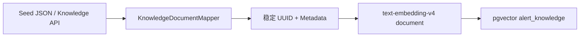
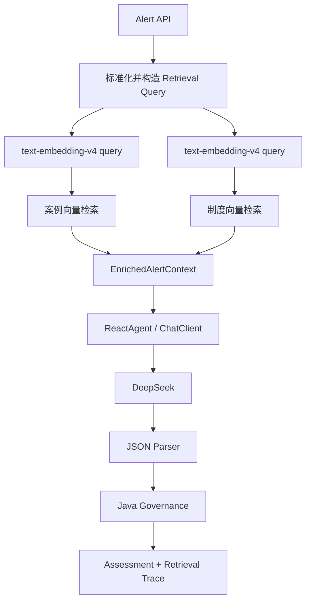

# V0.2 架构说明

## 1. 模型职责分离

```text
DeepSeek V4                  text-embedding-v4
生成、推理、结构化研判        Query/Document 向量化
          │                           │
          └──────── Spring AI ────────┘
```

Chat Model 和 Embedding Model 是两个独立能力。V0.2 不尝试让 DeepSeek 生成向量，而是通过 Spring AI 的 `EmbeddingModel` 抽象接入 DashScope。

## 2. 知识入库链路



文档 ID 由 `knowledgeType + sourceId + version` 确定生成。pgvector 使用 `ON CONFLICT` 更新同一 ID，因此重启种子导入不会制造重复数据。

Metadata 当前包含：

- `knowledgeType`
- `sourceId`
- `title`
- `body`
- `version`
- `active`
- `verdict`
- `keywordsJson`
- `recommendedActionsJson`

列表被编码为 JSON 字符串，保证 VectorStore Metadata 只使用简单类型。

## 3. 告警研判链路



案例和制度使用同一个 pgvector 表，通过固定 Metadata Filter 隔离：

```text
knowledgeType == 'HISTORICAL_CASE' && active == true
knowledgeType == 'POLICY_RULE' && active == true
```

## 4. Query / Document 非对称向量

`TaskAwareDashScopeEmbeddingModel` 对 Spring AI 的接口做一层适配：

- `VectorStore.add(Document)` 使用 `text_type=document`
- `VectorStore.similaritySearch(query)` 使用 `text_type=query`

这避免把查询语句按文档任务向量化。

## 5. 可信边界

模型被视为不可信组件：

1. 检索步骤由 Java 强制执行；
2. 原始告警放入 `<untrusted_alert_data>`；
3. 模型仅能引用实际召回的 Case/Policy ID；
4. 输出经过 Java 反序列化与字段约束；
5. CRITICAL、证据不足、低置信度强制人工复核；
6. V0.2 不提供任何高风险写操作 Tool。

## 6. 当前限制

V0.2 是可工作的 Dense RAG 基线，但还没有：

- BM25/Sparse 召回；
- RRF 融合；
- Cross-Encoder/Reranker；
- 父子 Chunk 和页码引用；
- 租户、部门、知识生效时间过滤；
- StateGraph Checkpoint 与 Human-in-the-Loop 持久化。
