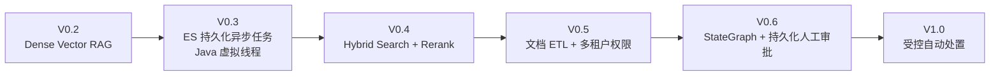
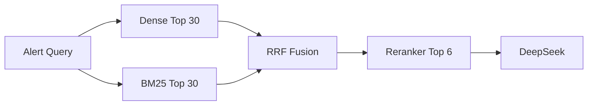
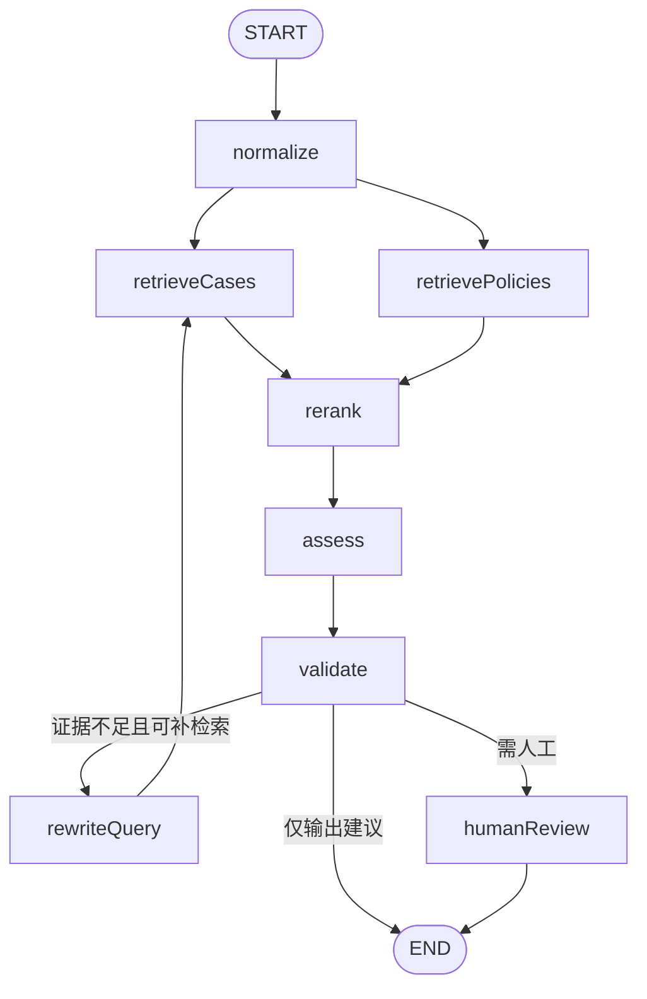

# 演进路线



## V0.2：Dense Vector RAG（已完成）

- DashScope `text-embedding-v4`；
- pgvector HNSW + Cosine；
- Query/Document 非对称向量；
- 案例/制度 Metadata 过滤；
- Upsert、搜索、删除、种子重建 API；
- Retrieval Trace 与召回分数；
- DeepSeek 结构化研判与 Java 治理。

## V0.3：ES 持久化异步任务 + Java 虚拟线程（当前，已完成）

- 告警任务先以固定 `alertId` 写入 Elasticsearch；
- `PENDING/RUNNING/RETRY_WAIT/SUCCEEDED/DEAD` 状态机；
- Java 21 虚拟线程执行阻塞式 RAG 与模型调用；
- `Semaphore` 控制单实例真实在途并发；
- `SeqNoPrimaryTerm` 乐观锁处理多实例抢占；
- `runId + leaseUntil` 防止旧结果覆盖并支持宕机恢复；
- 指数退避、最大尝试次数和恢复扫描；
- 异步提交、状态查询和同步兼容 API；
- Docker Compose 中加入 Elasticsearch；
- 架构图、完整时序图和运维手册。

## V0.4：Hybrid Search + Rerank



交付项：

- PostgreSQL FTS 或 OpenSearch/Elasticsearch BM25；
- Dense/BM25 结果归一化与 RRF；
- `qwen3-rerank` 或自托管 Cross-Encoder；
- 保存召回分、融合分和重排分；
- 离线评估 Recall@K、MRR、nDCG；
- 在线记录检索版本和回归样本。

## V0.5：文档 ETL 与多租户权限

- PDF、Markdown、HTML、工单与历史案件导入；
- Chunk、父子文档、标题路径、页码；
- `tenantId`、`departmentId`、`classification`；
- 生效时间、失效时间、版本与撤销；
- 入库前脱敏、恶意文档检查与内容安全；
- 检索前强制权限过滤，避免先召回后过滤造成越权；
- 多租户配额、热点租户治理和审计。

## V0.6：Spring AI Alibaba StateGraph + 持久化人工审批

建议状态：

```text
AlertState
├── rawAlert
├── normalizedAlert
├── retrievalQuery
├── denseResults
├── sparseResults
├── rerankedResults
├── assessment
├── validationErrors
├── retryCount
├── approval
└── executionResult
```

建议节点：



配套 PostgreSQL/Redis Checkpointer：

- 图节点级别中断与恢复；
- 审批人、审批意见和调整后的 Assessment；
- 任务状态与图 Checkpoint 的一致性设计；
- 超时、取消、重试和审计；
- 显式 re-run API，保留原任务和新任务关联关系。

## V1.0：受控自动处置

自动处置前必须增加：

- Tool Registry 与 JSON Schema；
- RBAC/ABAC；
- 租户、资源和操作范围边界；
- 高风险操作审批；
- Idempotency Key；
- 超时、重试、熔断和限流；
- Outbox/Saga 或等价的可靠事件机制；
- 执行前模拟、执行后验证和补偿；
- 不可抵赖审计；
- Kill Switch 与人工接管；
- 安全红队、越权测试和故障演练。
