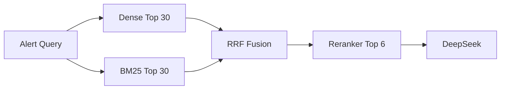

# 演进路线

## V0.2：Dense Vector RAG（当前）

- DashScope `text-embedding-v4`
- pgvector HNSW + Cosine
- Query/Document 非对称向量
- 案例/制度 Metadata 过滤
- Upsert、搜索、删除、种子重建 API
- Retrieval Trace 与召回分数

## V0.3：Hybrid Search + Rerank



交付项：

- PostgreSQL FTS 或 OpenSearch BM25；
- Dense/BM25 结果归一化与 RRF；
- `qwen3-rerank` 或自托管 Cross-Encoder；
- 保存召回分、融合分和重排分；
- 离线评估 Recall@K、MRR、nDCG。

## V0.4：文档 ETL 与权限

- PDF、Markdown、HTML、工单与历史案件导入；
- Chunk、父子文档、标题路径、页码；
- `tenantId`、`departmentId`、`classification`；
- 生效时间、失效时间、版本与撤销；
- 入库前脱敏与内容安全检查。

## V0.5：Spring AI Alibaba StateGraph

建议状态：

```text
AlertState
├── rawAlert
├── normalizedAlert
├── retrievalQuery
├── denseResults
├── sparseResults
├── rerankedResults
├── assessment
├── validationErrors
├── retryCount
├── approval
└── executionResult
```

建议节点：


配套 Redis/PostgreSQL Checkpointer，支持中断、恢复、人工审批和执行审计。

## V1.0：受控处置

自动处置前必须增加：

- Tool Registry 与 JSON Schema；
- RBAC/ABAC；
- 租户与资源边界；
- 高风险操作审批；
- Idempotency Key；
- 超时、重试、熔断；
- Outbox/Saga；
- 执行前模拟与执行后验证；
- 不可抵赖审计。
