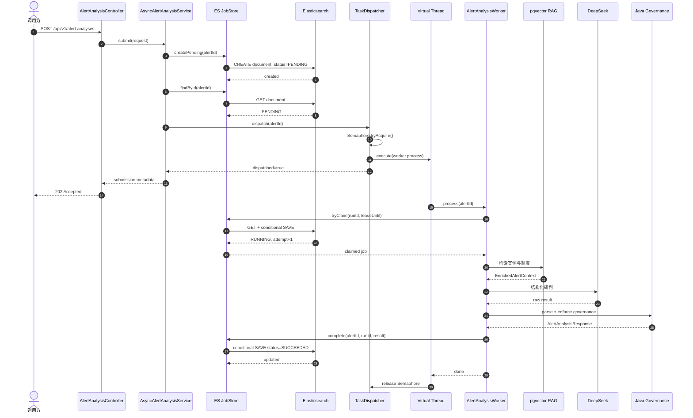
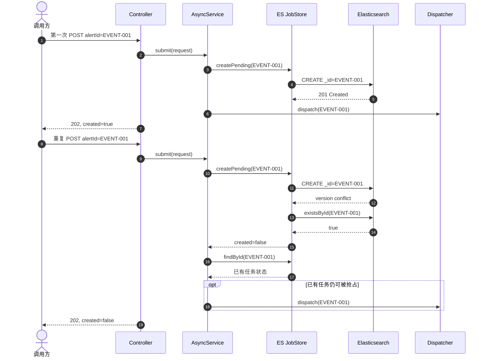
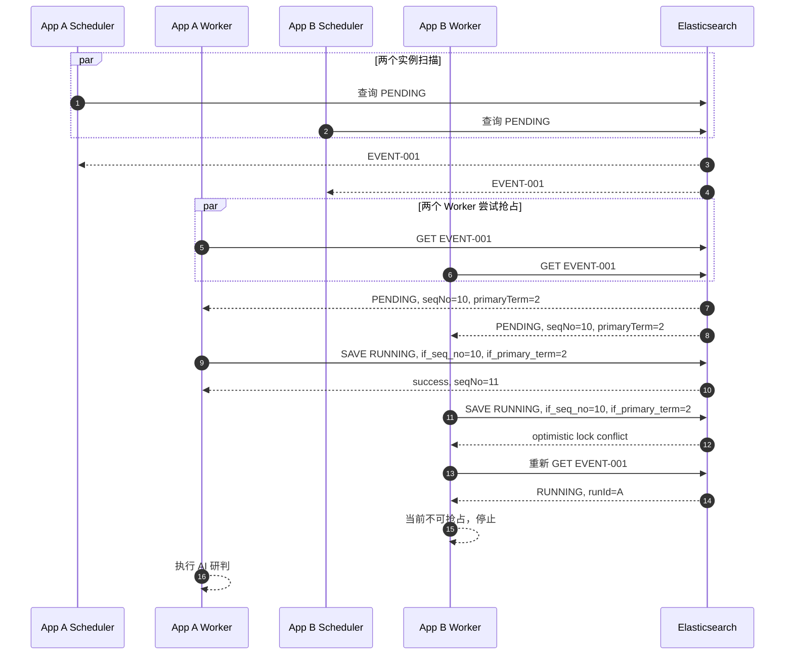
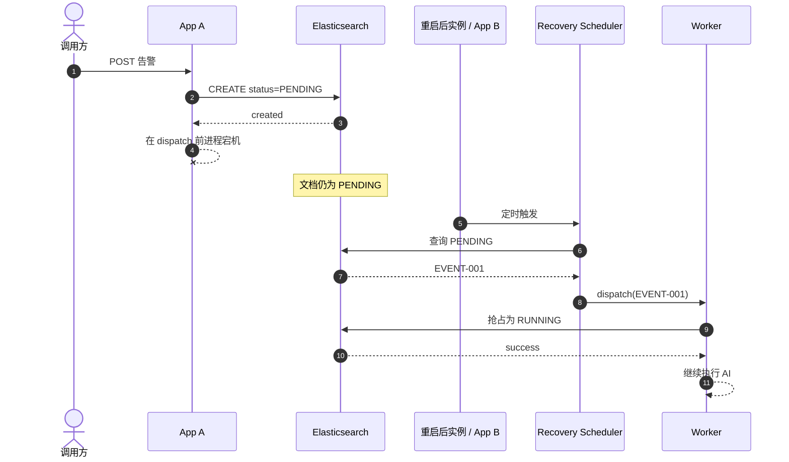
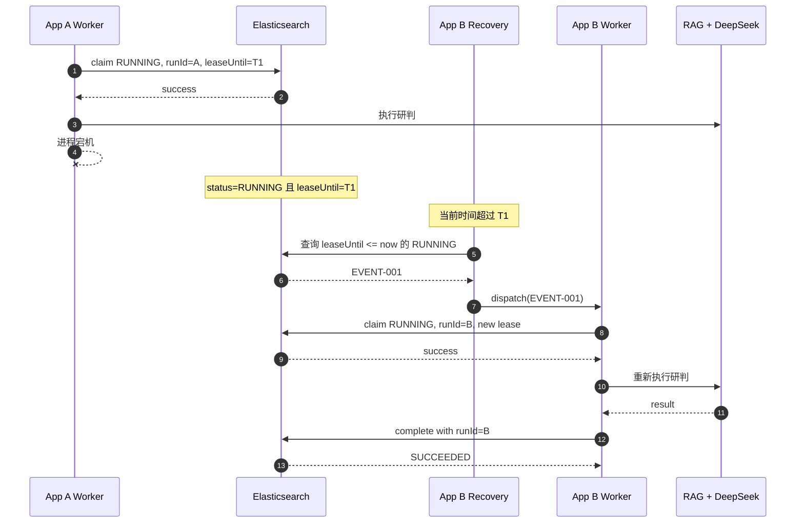
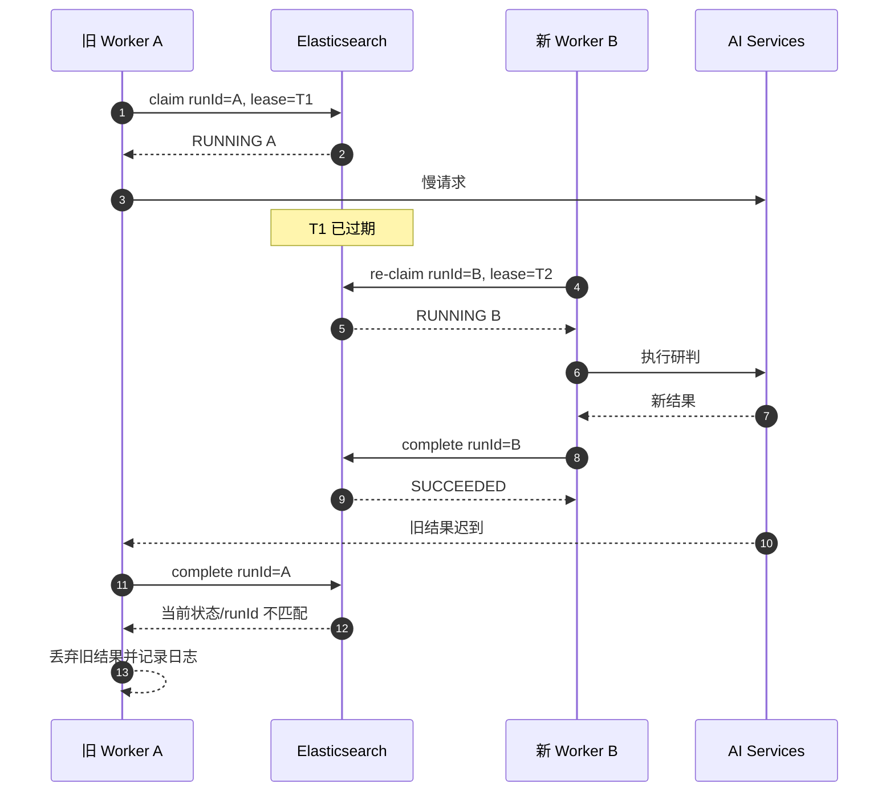
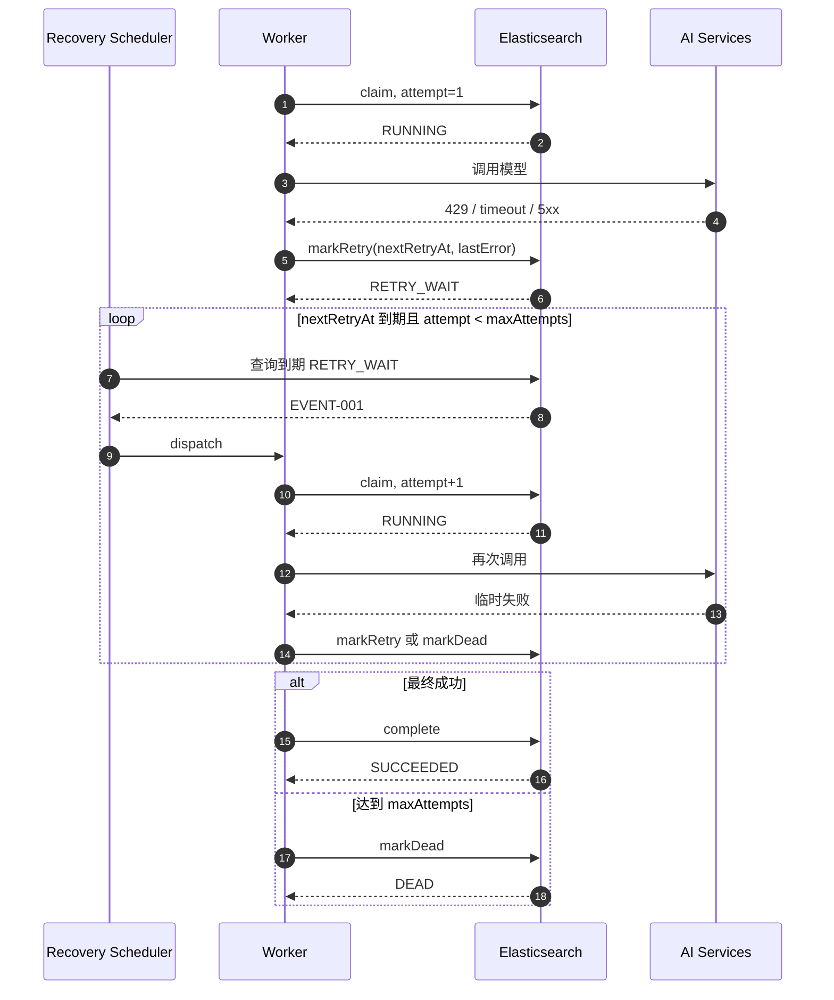
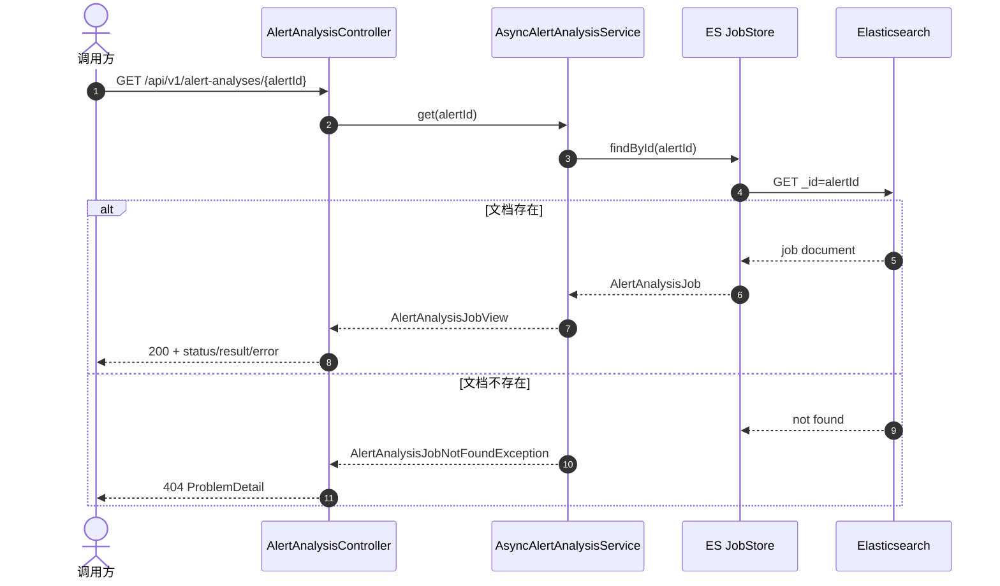

# V0.3 告警研判时序图

本文与 `main` 分支 V0.3 实现一致，覆盖正常请求、重复提交、多实例竞争、宕机恢复、旧结果拒绝、重试和状态查询。

## 1. 正常异步研判

关键点：`202 Accepted` 通常先于 AI 完成返回；任务可靠性依赖 ES 中的持久化状态，不依赖内存 Future。

## 2. 重复提交同一个 alertId

同一 `alertId` 被视为同一不可变任务。重复请求中的新 payload 不会覆盖原 payload。

## 3. 多实例同时抢占同一任务

允许多个实例看到同一个候选任务，但 ES 乐观锁保证只有一个状态迁移成功。

## 4. ES 已持久化、线程调度前宕机

这是“先写 ES、后创建虚拟线程”的主要价值。

## 5. AI 执行过程中实例宕机

任务可能被重新执行，因此 RAG 和模型调用必须无副作用。

## 6. 旧 Worker 迟到，不能覆盖新结果

`runId` 是业务所有权令牌，不能只依赖线程是否还活着。

## 7. 临时失败、指数退避与 DEAD

`DEAD` 后当前自动流程停止，需要人工检查错误、修复依赖并通过后续显式 re-run 能力重新发起。

## 8. 状态查询

## 9. 时序约束总结

- `CREATE(PENDING)` 必须发生在 `dispatch` 之前；
- `202` 不等待 `tryClaim`、RAG、模型或结果回写；
- 每次有效执行必须先取得新的 `runId` 和租约；
- 结果回写必须验证当前 `runId`；
- 恢复调度仍需通过同一个 Dispatcher，不得绕过 `Semaphore`；
- 重试只改变任务状态和下一次执行时间，不在调用线程中无限循环；
- 所有外部 I/O 必须配置硬超时，租约必须大于完整研判链路的最大合理耗时。
